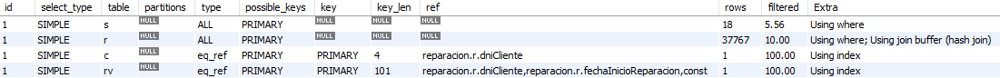
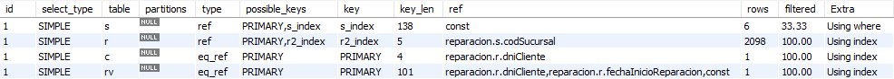

# 2.Listar DNI, nombre y apellido de todos los clientes ordenados por DNI en forma ascendente. Realice la consulta en ambas bases. ¿Qué diferencia nota en cuanto a performance? ¿Arrojan los mismos resultados? ¿Qué puede concluir en base a las diferencias halladas?

```sql
--reparaciones
SELECT dniCliente, nombreApellidoCliente
FROM cliente
ORDER BY dniCliente

-- reparaciones_dn
SELECT dniCliente, nombreApellidoCliente
FROM reparacion
ORDER BY dniCliente
```

|                   | Performance | Cant. resultados |
| ----------------- | ----------- | ---------------------- |
| `reparaciones`    | 0,016 segundos | 20000 |
| `reparaciones_dn` | 0,063 segundos | 162252 |

La consulta sobre `reparaciones` retorna una sola tuplas para cada DNI y nombre, mientras que `reparaciones_dn` tiene tuplas con el DNI y nombre repetidos. Con esto podemos concluir que una BD normalizada no sólo es más eficiente, sino que también es más consistente con sus resultados.

# 3. Hallar aquellos clientes que para todas sus reparaciones siempre hayan usado su tarjeta de crédito primaria (nunca la tarjeta secundaria). Realice la consulta en ambas bases.

```sql
-- reparaciones
SELECT c.dniCliente, c.nombreApellidoCliente
FROM cliente c
WHERE NOT EXISTS (
	SELECT *
	FROM Reparacion r
    WHERE r.dniCliente = c.dniCliente AND r.tarjetaReparacion = c.tarjetaSecundaria
)

-- reparaciones_dn
SELECT *
FROM reparacion r
WHERE NOT EXISTS (
	SELECT *
    FROM reparacion r2
    WHERE r.dniCliente = r2.dniCliente AND r.tarjetaSecundaria = r2.tarjetaReparacion
)
```

# 4. Crear una vista llamada ‘sucursalesPorCliente’ que muestre los dni de los clientes y los códigos de sucursales de la ciudad donde vive el cliente. Cree la vista en ambas bases.

```sql
-- reparacion
CREATE VIEW sucursalesPorCliente AS
    SELECT c.dniCliente, s.codSucursal
    FROM cliente c INNER JOIN sucursal s ON  c.ciudadCliente = s.ciudadSucursal
    ORDER BY c.dniCliente;

-- reparacion_dn
CREATE VIEW sucursales AS
	SELECT DISTINCT codSucursal, ciudadSucursal
	FROM reparacion;

CREATE VIEW clientes AS
	SELECT DISTINCT dniCliente, ciudadCliente
	FROM reparacion;

CREATE VIEW sucursalesPorCliente AS
	SELECT dniCliente, codSucursal
    FROM sucursales INNER JOIN clientes ON ciudadCliente = ciudadSucursal
    ORDER BY dniCliente;
```

# 5. En la base normalizada, hallar los clientes que dejaron vehículos a reparar en todas las sucursales de la ciudad en la que viven

## a. Realice la consulta sin utilizar la vista creada anteriormente

```sql
SELECT dniCliente FROM cliente c
WHERE (
	SELECT COUNT(codSucursal) FROM sucursal s
    WHERE c.ciudadCliente = s.ciudadSucursal)
= (
	SELECT COUNT(DISTINCT s.codSucursal) FROM reparacion r
    INNER JOIN sucursal s ON r.codSucursal = s.codSucursal
    WHERE c.dniCliente = r.dniCliente
    AND c.ciudadCliente = s.ciudadSucursal
)
ORDER BY dniCliente
LIMIT 100;
```

## b. Realice la consulta utilizando la vista creada anteriormente
```sql
SELECT dniCliente FROM cliente c
WHERE (
	SELECT COUNT(codSucursal) FROM sucursalesPorCliente s
    WHERE c.dniCliente = s.dniCliente)
= (
	SELECT COUNT(DISTINCT s.codSucursal) FROM reparacion r
    INNER JOIN sucursal s ON r.codSucursal = s.codSucursal
    WHERE c.dniCliente = r.dniCliente
    AND c.ciudadCliente = s.ciudadSucursal
)
ORDER BY dniCliente
LIMIT 100;
```

# 6. Agregar la siguiente tabla

**REPARACIONESPORCLIENTE**

idRC: int(11) PK AI

dniCliente: int(11)

cantidadReparaciones: int(11)

fechaultimaactualizacion: datetime

usuario: char(16)

```sql
CREATE TABLE reparacionesporcliente(
	idRC INT(11) PRIMARY KEY AUTO_INCREMENT,
    dniCliente INT(11) NOT NULL,
    cantidadReparaciones INT(11) DEFAULT(0) NOT NULL,
    fechaUltimaActualizacion DATETIME NOT NULL,
    usuario VARCHAR(16),
    FOREIGN KEY (dniCliente) REFERENCES cliente(dniCliente)
);
```

# 7.  Crear un Stored Procedure que realice los siguientes pasos dentro de una transacción:
* Realizar una consulta que para cada cliente (identificado por dniCliente), calcule la cantidad de reparaciones que tiene registradas. Registrar la fecha en la que se realiza la consulta y el usuario con el que la realizó.
* Guardar el resultado de la consulta en un cursor.
* Iterar el cursor e insertar los valores correspondientes en la tabla
REPARACIONESPORCLIENTE.

```sql
DELIMITER //
CREATE PROCEDURE storedProcedure() BEGIN
    DECLARE salir INT DEFAULT 0;
    DECLARE dni INT(11);
    DECLARE cant INT(11);
	DECLARE contar CURSOR FOR 
		SELECT dniCliente, COUNT(*) AS reparaciones
		FROM reparacion
		GROUP BY dniCliente;
	
    DECLARE CONTINUE HANDLER FOR NOT FOUND SET salir = 1;

    START TRANSACTION;
    
        OPEN contar;
        
        agregar: LOOP
            FETCH NEXT FROM contar INTO dni, cant;
            
            IF salir = 1 THEN
                LEAVE agregar;
            END IF;
            
            INSERT INTO reparacionesporcliente(
                dniCliente,
                cantidadReparaciones,
                fechaUltimaActualizacion,
                usuario		
            ) VALUES (
                dni,
                cant,
                NOW(),
                CURRENT_USER()
            );
        END LOOP;
    
    COMMIT;

    CLOSE contar;
END;
// DELIMITER ;
```

# 8. Crear un Trigger de modo que al insertar un dato en la tabla REPARACION, se actualice la cantidad de reparaciones del cliente, la fecha de actualización y el usuario responsable de la misma.

```sql
DELIMITER //
CREATE TRIGGER addReparacionesPorCliente
AFTER INSERT ON reparacion FOR EACH ROW
BEGIN
	UPDATE reparacionesporcliente SET
		cantidadReparaciones = (cantidadReparaciones + 1),
		fechaUltimaActualizacion = NOW(),
		usuario = CURRENT_USER()
	WHERE dniCliente = NEW.dniCliente;
END;
// DELIMITER ;
```
# 9. Crear un stored procedure que sirva para agregar una reparación, junto con una revisión de un empleado (`REVISIONREPARACION`) y un repuesto (`REPUESTOREPARACION`) relacionados dentro de una sola transacción.

El stored procedure debe recibir los siguientes parámetros: `dniCliente`, `codSucursal`, `fechaReparacion`, `cantDiasReparacion`, `telefonoReparacion`, `pagoConTarjetaPrimaria` (booleano), `empleadoReparacion`, `repuestoReparacion`. Los atributos restantes deben ser obtenidos de la tabla "Cliente".


```sql
DELIMITER //
CREATE PROCEDURE agregarReparacion(
	IN dniCliente INT, IN codSucursal INT, IN fechaReparacion DATETIME, IN cantDiasReparacion INT,
	IN telefonoReparacion VARCHAR(10), IN pagoConTarjetaPrimaria BOOLEAN,
	IN empleadoReparacion VARCHAR(255), repuestoReparacion VARCHAR(255)
) BEGIN
	DECLARE dirCliente VARCHAR(50);
    DECLARE ciudad VARCHAR(50);
    DECLARE tarjeta VARCHAR(20);
    
    SELECT domicilioCliente, ciudadCliente INTO dirCliente, ciudad
    FROM cliente c
    WHERE c.dniCliente = dniCliente;
    
    IF pagoConTarjetaPrimaria = 1 THEN
		SELECT tarjetaPrimaria INTO tarjeta
        FROM cliente c
        WHERE c.dniCliente = dniCliente;
	ELSE
		SELECT tarjetaSecundaria INTO tarjeta
        FROM cliente c
        WHERE c.dniCliente = dniCliente;
    END IF;
    
    START TRANSACTION;
    INSERT INTO reparacion (
		codSucursal, dniCliente, fechaInicioReparacion, cantDiasReparacion,
        telefonoReparacionCliente, direccionReparacionCliente,
        ciudadReparacionCliente, tarjetaReparacion
	) VALUES (
		codSucursal, dniCliente, fechaReparacion, cantDiasReparacion,
        telefonoReparacionCliente, dirCliente, ciudad, tarjeta);
	
    INSERT INTO revisionreparacion (
		dniCliente, fechaInicioReparacion, empleadoReparacion
	) VALUES (
		dniCliente, fechaReparacion, empleadoReparacion);
	
    INSERT INTO repuestoreparacion (
		dniCliente, fechaInicioReparacion, repuestoReparacion
	) VALUES (
		dniCliente, fechaReparacion, repuestoReparacion
    );
    COMMIT;
END;
// DELIMITER ;
```

# 10. Ejecutar el stored procedure del punto 9 con los siguientes datos:
* **dniCliente**: 1009443
* **codSucursal**: 100
* **fechaReparacion**: *'2013-12-14 12:20:31'*
* **empleadoReparacion**: *'Maidana'*
* **repuestoReparacion**: *'bomba de combustible'*
* **cantDiasReparacion**: 4
* **telefonoReparacion**: '*4243-4255*'
* **pagoConTarjetaPrimaria**: `True`

```sql
CALL agregarReparacion(1009443, 100, '2013-12-14 12:20:31', 4, '4243-4255', TRUE, 'Maidana', 'bomba de combustible');
```

# 11. Considerando la siguiente consulta analice su plan de ejecución mediante el uso de la sentencia EXPLAIN.
```sql
EXPLAIN (
	select count(r.dniCliente) from reparacion r, cliente c, sucursal s, revisionreparacion rv
    where r.dnicliente=c.dnicliente
		and r.codsucursal=s.codsucursal
		and r.dnicliente=rv.dnicliente
        and r.fechainicioreparacion=rv.fechainicioreparacion
        and empleadoreparacion = 'Maidana'
        and s.m2<200
        and s.ciudadsucursal='La Plata');
```


## a ¿Qué atributos del plan de ejecución encuentra relevantes para evaluar la performance de la consulta?
* `type`: tipo de acceso realizado sobre las filas. Hay algunos más eficientes que otros.
* `key`: índice seleccionado para realizar la operación. La elección correcta de un índice indica una mejor performance.
* `rows`: cantidad de filas sobre las que opera la consulta. Cuantas más filas haya, más lenta será.
* `filtered`: indica el porcentaje de filas que se espera que se filtren. Cuanto mayor sea el porcentaje, se considera que la consulta es más eficiente.

## b. Observe en particular el atributo type ¿cómo se están aplicando los `JOIN` entre las tablas involucradas?

El tipo `all` indica que las tablas se escanean por completo.

El tipo `eq_ref` indica que se está usando un índice que coincide entre ambas tablas para unirlas.

Comparando ambos tipos, `eq_ref` realiza el JOIN de manera más eficiente puesto que no evalúa las tablas completas.

## c. Según lo que observó en los puntos anteriores, ¿qué mejoras se pueden realizar para optimizar la consulta?

Se pueden agregar índices en las tablas `s` y `r`, que son las que se unen con el tipo `all`. De esta manera va a hacer un escaneo más eficiente.

## d. Aplique las mejoras propuestas y vuelva a analizar el plan de ejecución. ¿Qué cambios observa?
```sql
CREATE INDEX s_index ON sucursal(ciudadSucursal);
CREATE INDEX r2_index ON reparacion(codSucursal);
```
